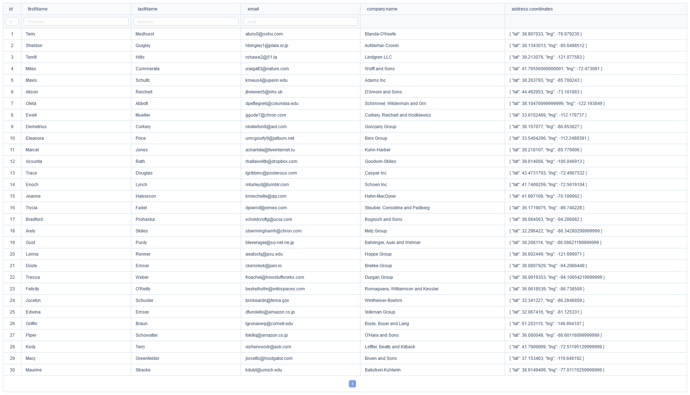

# OsTable

Simple datatable library based on Vue 3 and AT-UI.

## Usage

First install the library with following code:

```bash
npm i os-table
```

Then:

```js
<template>
  <os-table :data="data" :columns="columns" />
<template>

<script setup>
import OsTable from 'os-table';
<script>
```

## Example Code

```js
<template>
  <div class="container-fluid">
    <os-table
      :data="data"
      :columns="columns"
      border
      pagination
      sticky
      size="small"
      stripe
      :loading="loading"
      style="width: 100%"
    />
  </div>
</template>

<script setup>
import { ref } from "vue";

const data = ref([]);
const loading = ref(false);
const columns = ref([]);

const getData = async () => {
  loading.value = true;
  await fetch("/api/products")
    .then((res) => res.json())
    .then((res) => {
      data.value = res.products;
    });
  const filters = await fetch("/api/products/categories")
    .then((res) => res.json())
    .then((res) => res);
  columns.value = [
    {
      title: "id",
      key: "id",
      align: "center",
      width: 30,
      sortType: "normal",
    },
    {
      title: "Title",
      key: "title",
      sortType: "normal",
    },
    {
      title: "Description",
      key: "description",
    },
    {
      title: "Category",
      key: "category",
      meta: {
        filterType: "select",
        filters,
      },
      width: 120,
    },
    {
      title: "stock",
      key: "stock",
      align: "right",
    },
    {
      title: "Price",
      key: "price",
      sortType: "normal",
    },
  ];
  loading.value = false;
};

getData();
</script>
```

## Preview

[]
